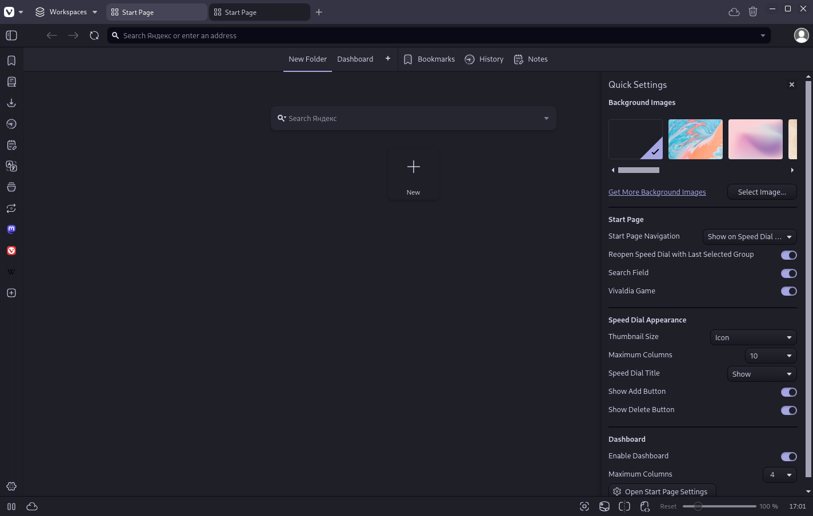

  <h1>Moonbloom for <a href="https://vivaldi.com">Vivaldi</a></h1>
  
Gentle on the eyes, evoking the cozy tranquility of a serene night.

  <a href="https://github.com/moonbloom-theme/moonbloom">Homepage</a> • <a href="https://moonbloom.teplostanski.dev">Website</a> • <a href="https://github.com/orgs/moonbloom-theme/discussions">Discussions</a> • <a href="https://donate.teplostanski.dev">Support Us</a>

 

> [Vivaldi](https://vivaldi.com) is a freeware, cross-platform web browser with a built-in email client.

## Install
See [INSTALL.md](./INSTALL.md)

  
  

